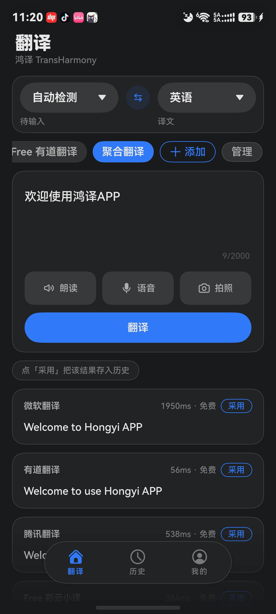
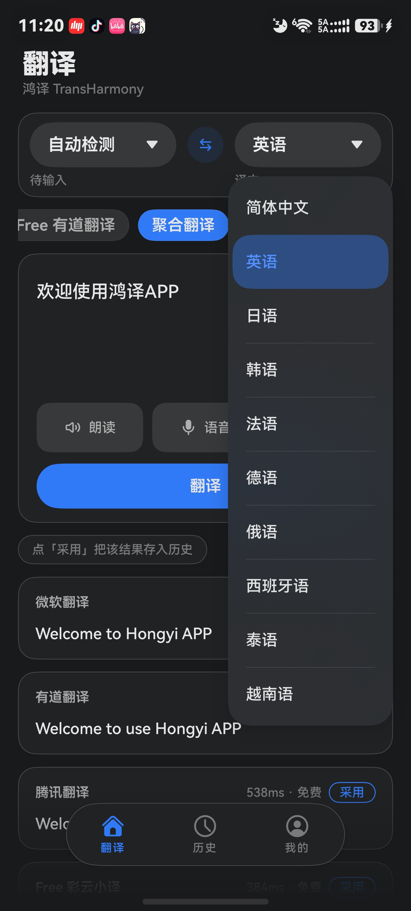
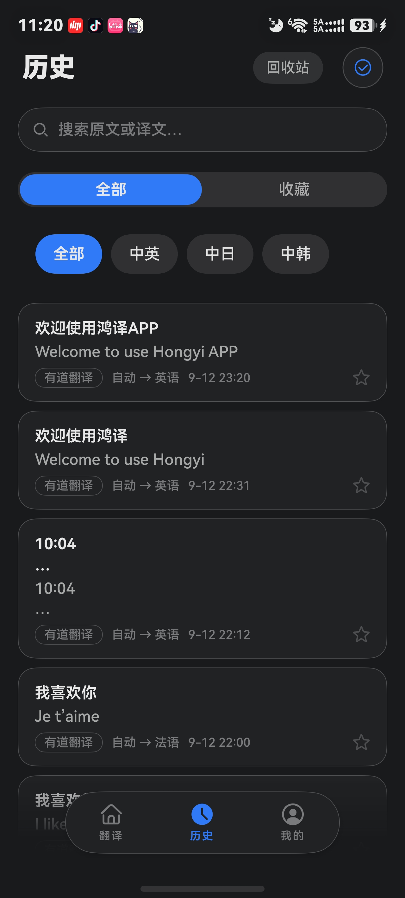
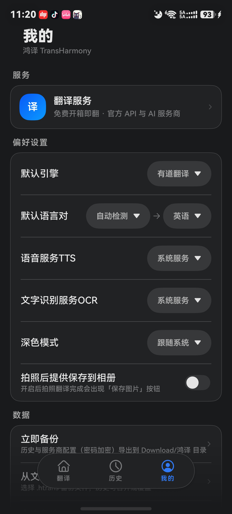
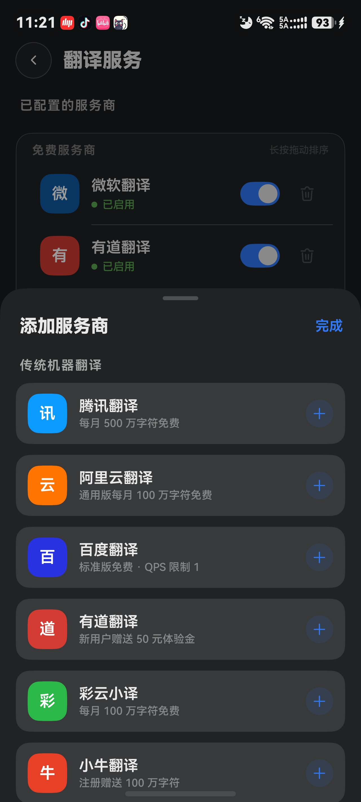
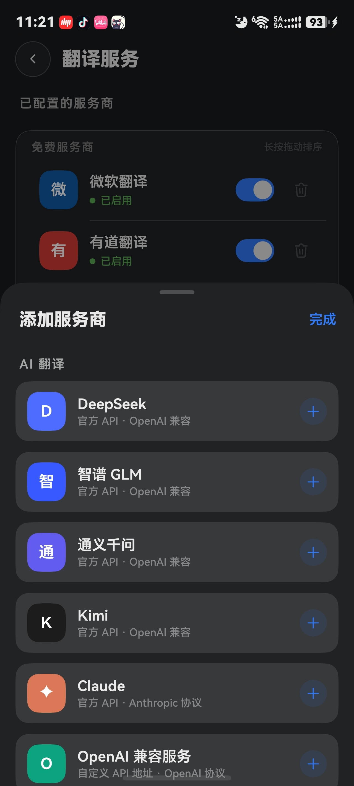
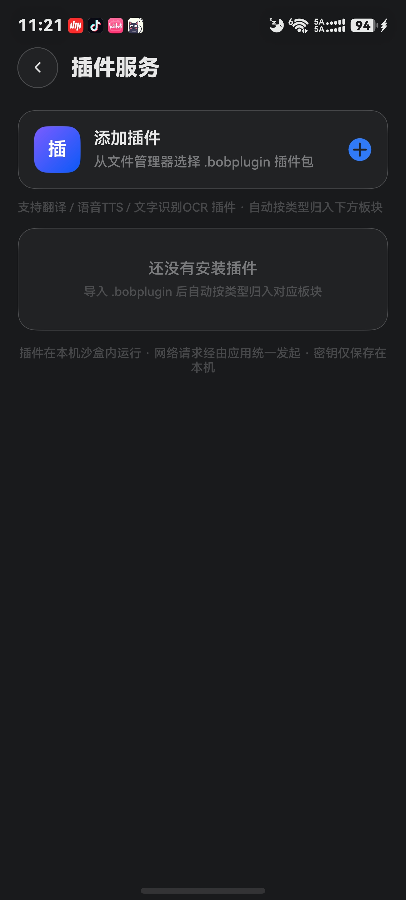

# 鸿译 TransHarmony

| 聚合翻译 | 语言选择 | 历史记录 |
|---|---|---|
|  |  |  |

| 我的 | 添加服务商 · 传统引擎 | 添加服务商 · AI 引擎 | 插件服务 |
|---|---|---|---|
|  |  |  |  |

鸿蒙（HarmonyOS NEXT）原生翻译应用：**基础翻译永久免费、无广告**，多引擎即切即比，支持 BYOK 接入 AI 大模型与插件生态，数据全部留在本机。

- 免费通道开箱即翻，无需注册任何账号
- 传统引擎 / AI 大模型 / 插件三类服务统一管理，聚合并发翻译
- 支持兼容 **Bob**（.bobplugin）与 **Manggo**（.mplugin）插件包，导入即用

## 功能特性

**翻译**
- 文本翻译：自动检测源语言，单引擎 / 聚合模式（并发所有引擎、结果逐个返回、一键采用）
- 免费通道开箱即翻：微软 Bing（默认引擎）、有道，无需配置
- BYOK 传统引擎：腾讯云、阿里云、Azure、百度翻译、彩云、小牛、有道智云
- AI 大模型（BYOK）：OpenAI 兼容（DeepSeek / GLM / 通义 / Kimi / 小米 MiMo / OpenAI 官方及任意兼容服务）+ Anthropic 协议，流式输出逐字显示，自动获取模型列表，支持自定义翻译 Prompt
- 语音输入：识别可暂停/继续，识别完成自动翻译
- 图片翻译：拍照 / 相册取图，系统端侧 / 云端 / 插件 OCR 识别后翻译，照片默认用后即焚
- 译文朗读：系统 TTS、云端 TTS 或插件 TTS，支持暂停 / 继续

**语音与识别服务（云端，可选）**
- 语音服务 TTS：小米 MiMo、OpenAI 官方、OpenAI 兼容、Anthropic 兼容；预置音色即选即用 + 自定义音色，偏好设置中选择生效
- 文字识别服务 OCR：腾讯 OCR、百度 OCR 传统服务商 + AI 视觉大模型（与翻译 AI 目录同套，自动获取视觉模型）
- 服务商与翻译服务同款管理页：分组、开关、拖拽排序、连通测试；密钥同样加密存储本机

**插件系统（Bob / Manggo 兼容）**
- 从文件管理器导入 .bobplugin / .mplugin，即装即用
- 插件即引擎：自动进入引擎行，支持拖拽排序、开关、聚合并发
- 插件沙盒：JS 隔离运行，每插件独立 Env；CommonJS 多文件模块、ES Module 自动转换、fetch 流式（SSE）、内置 crypto-js；网络经应用统一发起，密钥仅存本机
- 多服务插件：一包多服务（翻译 + OCR + TTS），逐服务配置、勾选启用
- 词典类插件支持：词头 / 音标 / 词性释义

**体验与数据**
- 历史记录：搜索、收藏、语言对筛选、回收站（软删除保留 30 天）、详情页重译、批量删除
- 应用内备份与恢复：历史 + 服务商配置（翻译 / TTS / OCR，含密钥）+ 偏好 + 已安装插件，整包 AES-256-GCM 加密（.htrans），密码可选
- 平板 / 折叠屏适配（≥600vp 双列工作台）、深色模式全面适配、悬浮胶囊页签
- 隐私优先：无账号体系、无自建服务器，API 密钥经系统关键资产加密存储（Asset Store Kit）

## 支持的翻译服务

| 类型 | 服务 | 说明 |
|---|---|---|
| 免费通道 | 微软 Bing（默认）、有道 | 开箱即翻，无需配置 |
| 传统引擎（BYOK） | 腾讯云、阿里云、Azure、百度、彩云、小牛、有道智云 | 填入自己的凭证，密钥加密存储本机 |
| AI 大模型（BYOK） | DeepSeek、GLM、通义、Kimi、小米 MiMo、OpenAI 官方、Anthropic 及任意 OpenAI 兼容服务 | 流式输出，自定义模型与 Prompt |
| 云端语音 TTS（BYOK） | 小米 MiMo、OpenAI 官方、OpenAI 兼容、Anthropic 兼容 | 朗读译文，暂停/继续 |
| 云端文字识别 OCR（BYOK） | 腾讯 OCR、百度 OCR、AI 视觉大模型 | 拍照翻译识别图片文字 |
| 插件 | Bob / Manggo 兼容插件包 | 社区插件包导入即用，翻译 / OCR / TTS |

## 下载安装

前往 [Releases](https://github.com/TonyKingWJX/transharmony/releases) 下载 `.hap` 安装包（兼容 HarmonyOS 6.1.1 及以上）。

> 未签名包需自行签名后安装；正式上架华为应用市场的时间请关注 Release 页面。

## 从源码构建

```bash
# 1. 安装 DevEco Studio（华为官方 IDE，内置 SDK 管理器）
#    https://developer.huawei.com/consumer/cn/deveco-studio/
# 2. 打开本仓库根目录（完整 hvigor 工程），File → Open 即可
# 3. 等待 Sync 完成（自动安装 oh_modules 依赖），在模拟器或真机上运行
```

使用 BYOK 引擎时，在「我的 → 翻译服务」中填入对应服务商凭证即可；免费通道与插件无需任何配置。

## 工程结构

```
├── AppScope/                        # 应用级配置（bundleName、应用名、图标）
├── docs/                            # 引擎调研、UI 设计稿、截图
├── tools/                           # 开发调试用 mock 插件
└── entry/src/main/
    ├── cpp/                         # 插件沙盒运行时（JSVM 宿主：Bob shim / Manggo bootstrap）
    ├── module.json5                 # 权限声明（仅网络 + 麦克风）
    └── ets/
        ├── pages/                   # 翻译 / 历史 / 服务商 / 语音与识别服务 / 图片翻译 / 插件等页面
        ├── components/              # 引擎选择器、语言选择器、添加服务商面板
        ├── models/                  # 语言枚举、请求/响应类型
        ├── services/                # 引擎适配器、云端 TTS/OCR 执行器、插件适配器、存储、备份、敏感词检测
        └── utils/                   # HTTP 客户端（含 SSE 流式）、签名、编解码工具
```

**核心抽象——引擎插件化**：所有翻译服务（传统引擎 / AI / 插件）实现同一 `TranslatorAdapter` 接口，由 `EngineRegistry` 统一注册，`TranslateUseCase` 编排「取凭证 → 调引擎 → 存历史」。新增引擎只需实现接口并注册，UI 零改动。

## 隐私说明

- 无账号、无埋点、无自建服务器；历史与配置全部存储在本机
- 发起翻译时，输入文本仅发送给你选择的服务商 / 插件配置的服务商
- 服务商密钥经系统关键资产加密存储（Asset Store Kit），卸载即全部删除

完整隐私政策见应用内「我的 → 关于 → 隐私政策」。

## 反馈

- 问题与建议：[Issues](https://github.com/TonyKingWJX/transharmony/issues)
- 用户交流：应用内「我的 → 用户反馈交流」扫码加群

## License

[Apache-2.0](LICENSE)
